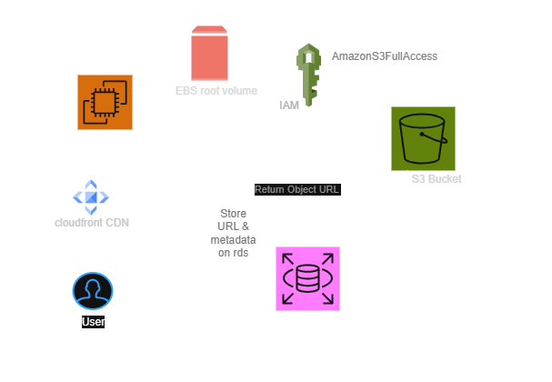

# CloudVault – AWS Secure File Upload & Storage System
CloudVault is a real-world AWS cloud storage application designed with security, scalability, cost optimization, and monitoring in mind.


## Architecture


## Architecture Flow


## Project Structure
```
    cloudvault/
    │
    ├── frontend/
    │   ├── index.html
    │   └── style.css
    │
    ├── backend/
    │   └── upload.php
    │
    ├── Screenshot/
    │
    ├── sql/
    │   └── cloudvaultdb.sql
    │
    ├── architecture/
```

# Features 

- Secure browser-based uploads
- File deletion synchronized across S3 and database
- Storage cost optimization using S3 lifecycle rules
- Centralized logging and monitoring with CloudWatch
- IAM role–based security (no hardcoded credentials)

## File Upload Workflow

- User selects a file using the web interface.
- The file is sent to the backend server hosted on EC2.
- The backend uploads the file to an S3 bucket.
- S3 returns an object URL for the uploaded file.
- The object URL and file metadata are stored in the RDS database.

## Tech Stack

## AWS Services Used

| Service | Purpose |
|------|------|
| **Amazon EC2** | Hosts the application server (LEMP stack) |
| **Nginx** | Acts as a reverse proxy to route HTTP traffic to the Flask application |
| **Amazon S3** | Stores uploaded files |
| **Amazon RDS MySQL** | Stores metadata about uploaded files |
| **IAM Role** | Allows EC2 to securely access S3 without credentials |
| **S3 Lifecycle Rules** | Automatically move old files to lower-cost storage tiers |
| **Amazon SNS** | Sends email notifications on successful file uploads and alerts |
| **Amazon CloudWatch** | Monitors logs, metrics, and triggers alarms for system health |

## frontend & backend
| Technology | Purpose |
|-----------|---------|
| **HTML** | Structure of the user interface |
| **CSS** | Styling and layout for the application UI |
| **PHP** | Backend upload file logic |

## Storage Optimization – S3 Lifecycle Rules

To reduce long-term storage costs, the project uses **Amazon S3 Lifecycle Rules** to automatically transition uploaded files to lower-cost storage tiers.

| Age of Object | Storage Class |
|---------------|---------------|
| Day 0–29 | S3 Standard |
| Day 30–89 | S3 Standard-IA |
| Day 90–364 | S3 Glacier Deep Archive |
| Day 365+ | Automatically deleted |

This lifecycle policy helps optimize storage costs by moving older objects to cheaper storage classes and eventually removing outdated files.

S3 versioning is enabled to protect against accidental deletion or overwrite.

---

## Monitoring & Alerts

Notifications are delivered using **Amazon SNS**.

### CloudWatch Metrics

| Metric | Purpose |
|------|---------|
| **EC2 CPU Utilization** | Monitors server load and detects performance spikes |

### CloudWatch Alarms

| Alarm | Trigger Condition |
|------|-------------------|
| **High CPU Usage** | Alerts when CPU utilization exceeds safe threshold |
| **Instance Status Check Failures** | Detects EC2 system or instance-level failures |

## Future Improvements

Planned enhancements to improve scalability, automation, and cloud architecture:

- Implement **S3 Pre-Signed URLs** for direct browser uploads to S3
- Add **event-driven processing** using S3 events and AWS Lambda
- Use **Amazon CloudFront CDN** for faster file delivery
- Build a **file management dashboard** to view and manage uploaded files
- Automate infrastructure using **Terraform or AWS CloudFormation**

---

## Author
**Satish Pathade**   
AWS Cloud & DevOps Engineer